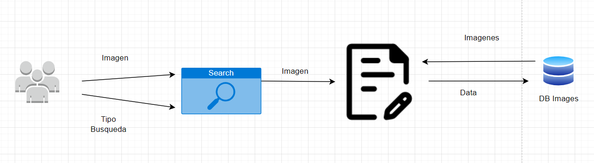
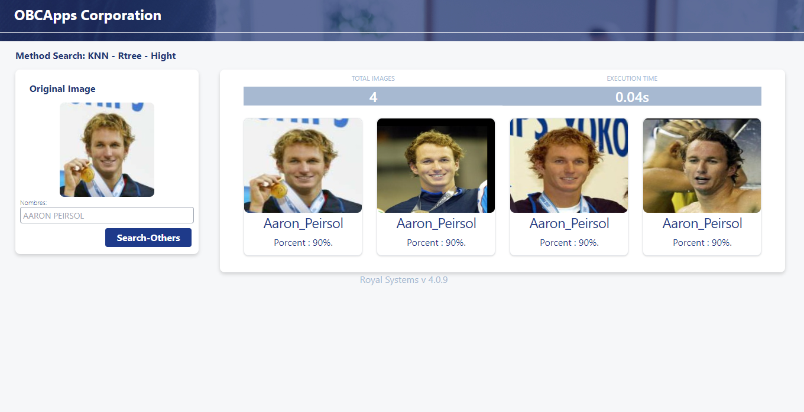
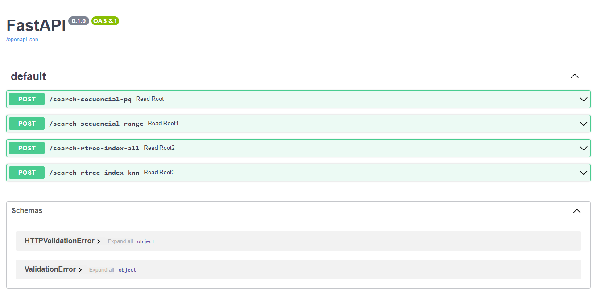
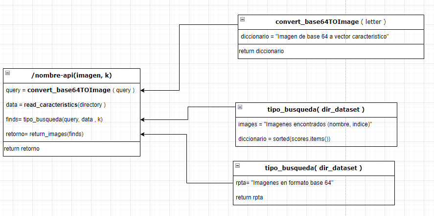
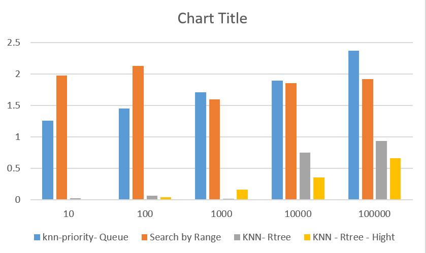
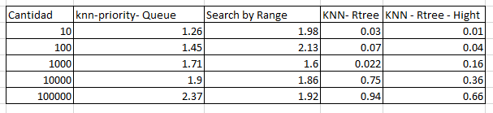

# Base de Datos Multimedia

## Introducción

El logro está enfocado a entender y aplicar los algoritmos de búsqueda y recuperación de la información basado en el contenido 

Este proyecto está enfocado al uso una estructura multidimensional para dar soporte a las búsqueda y recuperación eficiente de imágenes en un servicio web de reconocimiento facial.

## Descripción del Sistema

El sistema consta de un backend y un frontend. El backend es un servicio web de reconocimiento facial que implementa la extracción de características, la indexación de vectores característicos y los algoritmos de búsquedas. El frontend es una aplicación web adaptativa que permite interactuar con el servicio web y muestra los resultados de búsqueda de manera interactiva.

### Backend

El backend del sistema se encarga de los siguientes pasos:

1. Extracción de características:
   - Se utiliza la librería Face_Recognition para obtener una representación compacta y representativa del rostro (encoding) a partir de cada imagen de rostro. El tamaño del vector característico es de 128 dimensiones.

2. Indexación y Búsqueda:
   - Implementación del algoritmo de búsqueda KNN secuencial, que realiza búsquedas sin indexación utilizando una cola de prioridad para recuperar los objetos más similares.
   - Implementación del algoritmo de búsqueda por rango, que realiza búsquedas en un radio de distancia al objeto de consulta.
   - Uso de la librería Rtree, para realizar busquedas con indexación de mayor efectividad.  
   - Uso de la libre PCA para reducir el tamaño de los vectores caracteriscos pero sin perder la información  

3. Experimento:
   - Ejecución de los algoritmos de búsqueda KNN secuencial, KNN-RTree y KNN-HighD sobre una colección de objetos de tamaño N. Comparación de la eficiencia en función del tiempo de ejecución.

### Frontend

El frontend del sistema es una aplicación web adaptativa que interactúa con el servicio web de reconocimiento facial. Los pasos del frontend son:

1. Motor de Búsqueda:
   - El usuario puede realizar consultas utilizando cualquier imagen que contenga un rostro.
   - La aplicación web envía la imagen de consulta al servicio web y muestra los resultados de búsqueda.

2. Resultados de Búsqueda:
   - La aplicación web muestra interactivamente los resultados de búsqueda, incluyendo el rostro de consulta y el valor de K (número de objetos más parecidos).

## Requisitos

Se requiere tener instalados los siguientes componentes:

- Python
- uvicorn
- FastAPI
- Rtree
- NumPy
- Face_Recognition

## Instrucciones de Instalación

Para instalar y ejecutar el backend, siga los siguientes pasos:

1. Clonar el repositorio del backend:
```
git clone https://github.com/OBCApps/back-face-recognition.git
cd back-face-recognition
python main.py
```  

2. Clonar el repositorio del Frontend:
```
git clone https://github.com/OBCApps/front-face-recognition.git
cd front-face-recognition
npm install
ng serve --open
```  

## Función de las técnicas
### FLUJO GENERAL  


### Vista Web
#### Vista principal
<center>

</center>

#### Vista Agregar imagen
<center>

</center>

#### Vista visualizar resultados
<center>

</center>

### Backends Implementados



### Códigos importantes  

#### Face Recognition (face_reconigtion.py)  
En ella se encuentra funciones relativas al reconocimiento facial.  Estas funciones permiten extraer y almacenar características de los rostros presentes en imágenes, así como cargar,  procesar y guardar esas características para tareas de reconocimiento facial. 

- Extracción de las características  
```py
def characterist_image(imagen_path):
    imagen = fr.load_image_file(imagen_path)
    caracteristicas = fr.face_encodings(imagen)
    if len(caracteristicas) > 0: # Es rostro
        return caracteristicas[0]    
    # No hay rostros
    return None
```  

- Escritura de los vectores caracteristcos en un archivo para mejorar la busqueda  
```py
def save_characteristics(caracteristicas, archivo_salida):
    
    with open(archivo_salida, "w") as file:
        for indice, (nombre_persona, caracteristicas_persona) in enumerate(caracteristicas.items(), start=1):
            nombre_persona_indice = f"{nombre_persona}_{str(indice).zfill(4)}"
            print(f"SAve: {nombre_persona_indice }")
            for caracteristica in caracteristicas_persona:
                file.write(nombre_persona_indice + ", " + ", ".join(str(x) for x in caracteristica) + "\n")

    print("Vectores característicos guardados en el archivo:", archivo_salida)
```  

#### Busqueda Knn_secuencial y por Rango (search_R_tree_index.py)  
En ella se encuentra funciones relativas al reconocimiento facial.  Estas funciones permiten extraer y almacenar características de los rostros presentes en imágenes, así como cargar,  procesar y guardar esas características para tareas de reconocimiento facial. 

- Busqueda Secuencia con cola de Prioridad
```py
def knn_secuencial_pq(query, data, k):
    pq = []
    
    for nombre_persona, caracteristicas_persona in data.items():
        for i, caracteristicas in enumerate(caracteristicas_persona, start=1):  # Índices comienzan desde 1
            distancia = np.linalg.norm(query - caracteristicas)
            indice_str = str(i).zfill(4)  # Agregar ceros a la izquierda
            heapq.heappush(pq, (-distancia, nombre_persona, indice_str))  # Usar distancia negativa para obtener los valores más cercanos
            
            if len(pq) > k:
                heapq.heappop(pq)
    
    vecinos_cercanos = [(nombre_persona, indice) for _, nombre_persona, indice in pq]
    vecinos_cercanos.sort()
    
    return vecinos_cercanos

```  

- Busqueda por Rango
```py
def knn_secuencial_rango(query, data, radio, k):
    vecinos_rango = []
    distancias = []    
    for nombre_persona, caracteristicas_persona in data.items():
        for i, caracteristicas in enumerate(caracteristicas_persona, start=1):  # Índices comienzan desde 1
            distancia = np.linalg.norm(query - caracteristicas)
            
            if distancia <= radio:
                distancias.append(distancia)
                indice_str = str(i).zfill(4)  # Agregar ceros a la izquierda
                vecinos_rango.append((nombre_persona, indice_str))
    
    vecinos_rango = [vecino for _, vecino in sorted(zip(distancias, vecinos_rango))]
    vecinos_rango = vecinos_rango[:k]
    
    return vecinos_rango
```  

#### Busqueda Rtree (search_R_tree_index.py)  
En ella se encuentra funciones relativas al reconocimiento facial.  Estas funciones permiten extraer y almacenar características de los rostros presentes en imágenes, así como cargar,  procesar y guardar esas características para tareas de reconocimiento facial. 

- Creación del indice R-tree
```py
def build_rtree_index(data):
    #print(data)
    p = index.Property()
    p.dimension = 128
    
    idx = index.Index(properties=p)
    for name, characteristic in data.items():
        for i, vector in enumerate(characteristic , start=1):
            
            idx.insert(i, tuple(vector) , obj=(name, i))
    return idx
```  

- Busqueda Knn en R-tree
```py
def buscar_knn_rtree(idx, query, k):
    resultados = idx.nearest(query, num_results=k, objects=True)
    k_elementos_cercanos = []
    
    for resultado in resultados:
        name, index_image = resultado.object
        index_str = str(index_image).zfill(4)  
        
        k_elementos_cercanos.append((name, index_str))
    
    return k_elementos_cercanos
```  


### Tabla de Comparación de tiempos

Grafica Resultados:  

Tabla resultados:  


## Conclusión

Según los resultados obtenidos en la tabla de comparación de tiempos, se concluye que el algoritmo KNN-RTree-Hight es más eficiente en términos de tiempo de ejecución en comparación con el KNN secuencial y el KNN-Rtree. Esto demuestra la importancia de utilizar técnicas de indexación espacial para lograr búsquedas eficientes en grandes colecciones de imágenes de rostros. Sin embargo, es importante considerar el efecto de la dimensionalidad en los índices espaciales y explorar soluciones como el PCA implementado para mitigar el problema de la maldición de la dimensionalidad en espacios vectoriales de alta dimensión.
